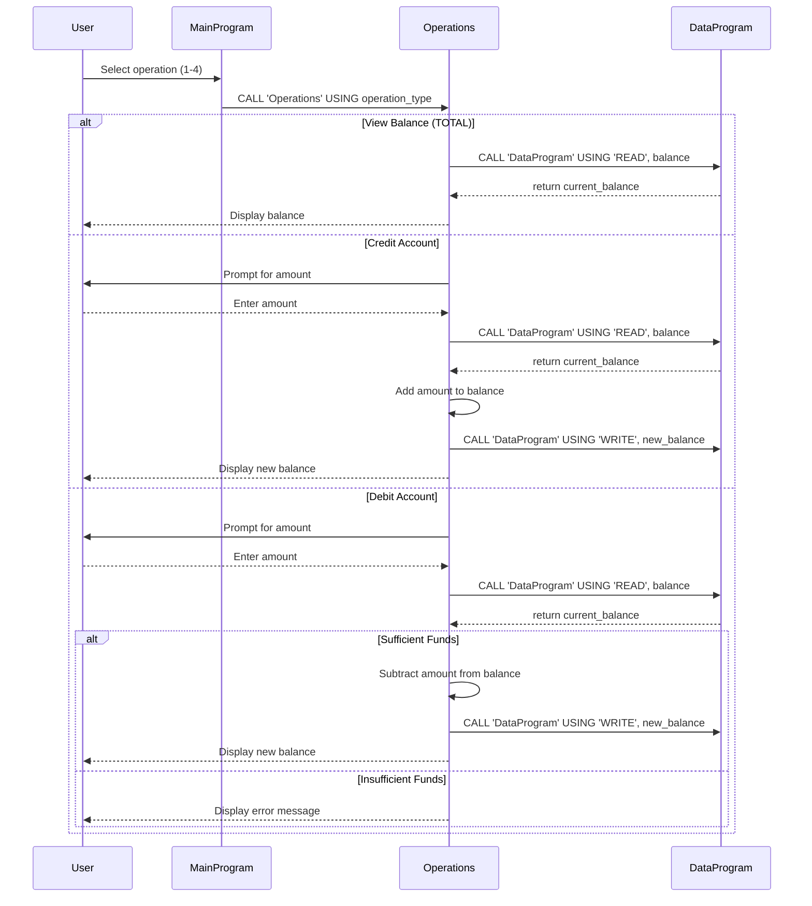

# COBOL Legacy Code Documentation

This repository contains a legacy COBOL-based account management system designed for student accounts. The system provides basic banking operations including viewing balance, crediting funds, and debiting funds.

## COBOL Files Overview

### data.cob
**Purpose**: Serves as the data storage layer for the account management system, managing persistent storage of account balance information.

**Key Functions**:
- `DataProgram`: A subprogram that handles read and write operations on the account balance
- Maintains a working storage balance initialized to $1000.00
- Supports two operations:
  - `READ`: Retrieves the current balance from storage
  - `WRITE`: Updates the balance in storage with a new value

**Business Rules**: Acts as the central data repository for account balance, ensuring data persistence across operations.

### main.cob
**Purpose**: Provides the main user interface and program flow control for the account management system.

**Key Functions**:
- `MainProgram`: Displays an interactive menu-driven interface
- Presents options for account operations (view balance, credit, debit, exit)
- Handles user input validation and navigation
- Calls the `Operations` program based on user selections
- Manages program termination

**Business Rules**: Controls the overall user experience and ensures proper sequencing of account operations.

### operations.cob
**Purpose**: Implements the core business logic for account transactions and balance inquiries.

**Key Functions**:
- `Operations`: Main subprogram that processes different account operations
- Supports three operation types:
  - `TOTAL`: Displays the current account balance
  - `CREDIT`: Adds funds to the account
  - `DEBIT`: Subtracts funds from the account (with validation)
- Handles user input for transaction amounts
- Performs balance calculations and updates

**Business Rules Related to Student Accounts**:
- **Initial Balance**: Student accounts start with a default balance of $1000.00
- **Credit Operations**: Students can add any positive amount to their account balance
- **Debit Operations**:
  - Students can subtract funds from their account
  - **Insufficient Funds Check**: Debits are only allowed if the account balance is greater than or equal to the debit amount
  - If insufficient funds, the transaction is rejected with an error message
- **Balance Viewing**: Students can view their current account balance at any time
- **Data Persistence**: All balance changes are immediately saved to persistent storage

## System Architecture

The system follows a modular COBOL architecture:
- `main.cob` serves as the entry point and user interface
- `operations.cob` contains the business logic and calls `data.cob` for data operations
- `data.cob` manages data persistence and storage operations

This separation allows for maintainable code where data operations are centralized and business logic is contained in dedicated modules.

## Sequence Diagram

The following Mermaid sequence diagram illustrates the data flow and program interactions within the COBOL account management system:

